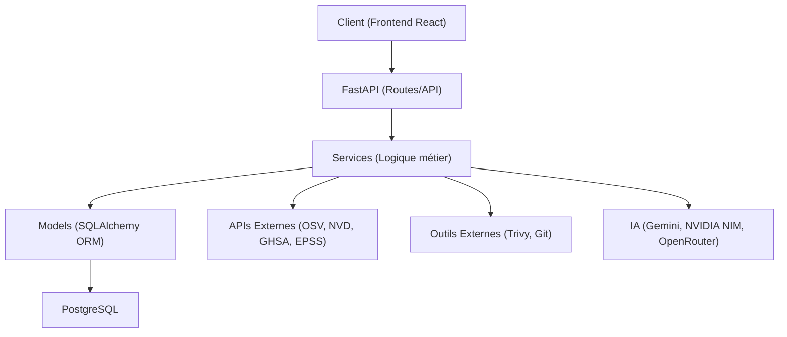
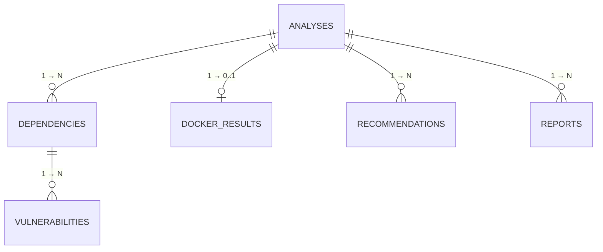
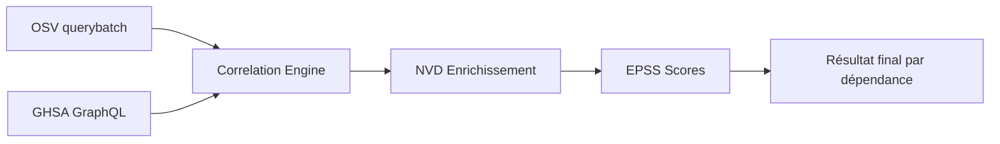

# Documentation Technique Complète — Backend NEXORA

> Générée par analyse exhaustive du code source le 2026-08-15.
> Chaque affirmation est vérifiable dans les fichiers cités.

---

## 1. Architecture Générale

### 1.1 Pattern architectural

Le backend suit une **architecture en couches (Layered Architecture)**, organisée comme suit :



| Couche | Rôle | Fichiers |
|---|---|---|
| **API (Routes)** | Endpoints HTTP, validation, sérialisation | [`analysis_routes.py`](file:///C:/Users/joseph/Documents/supply-chain-security/backend/app/routes/analysis_routes.py) |
| **Schemas** | Validation entrée/sortie Pydantic | [`analysis_schema.py`](file:///C:/Users/joseph/Documents/supply-chain-security/backend/app/schemas/analysis_schema.py) |
| **Services** | Logique métier, orchestration | `app/services/*.py` (7 fichiers) |
| **Models** | Représentation des tables PostgreSQL | `app/models/*.py` (6 fichiers) |
| **Core** | Configuration, connexion DB | [`config.py`](file:///C:/Users/joseph/Documents/supply-chain-security/backend/app/core/config.py), [`database.py`](file:///C:/Users/joseph/Documents/supply-chain-security/backend/app/core/database.py) |

### 1.2 Frameworks et librairies principales

| Librairie | Version | Rôle dans le projet |
|---|---|---|
| **FastAPI** | 0.136.3 | Framework web async, génération OpenAPI, validation Pydantic intégrée |
| **SQLAlchemy** | 2.0.50 | ORM pour PostgreSQL, Mapped columns (style 2.0) |
| **Alembic** | 1.18.4 | Migrations de schéma de base de données |
| **Pydantic** | 2.13.4 | Validation des entrées/sorties API |
| **GitPython** | 3.1.50 | Clonage de dépôts GitHub et extraction de commits |
| **httpx** | 0.28.1 | Client HTTP async pour les appels API (NVD, NVIDIA NIM) |
| **requests** | 2.34.2 | Client HTTP sync pour les appels API (OSV, GitHub) |
| **ReportLab** | 4.5.1 | Génération de rapports PDF professionnels |
| **google-generativeai** | 0.8.6 | Client officiel Gemini pour les recommandations IA |
| **psycopg2-binary** | 2.9.12 | Driver PostgreSQL pour SQLAlchemy |
| **Uvicorn** | 0.49.0 | Serveur ASGI (HTTP) pour FastAPI |

### 1.3 Organisation du projet

```
backend/
├── app/
│   ├── main.py                     ← Point d'entrée FastAPI, lifespan, CORS
│   ├── core/
│   │   ├── config.py               ← Configuration (.env → Pydantic Settings)
│   │   └── database.py             ← Engine SQLAlchemy, SessionLocal, Base
│   ├── models/                     ← 6 modèles SQLAlchemy (5 tables + __init__)
│   │   ├── analysis.py             ← Table centrale (analyses)
│   │   ├── dependency.py           ← Dépendances détectées
│   │   ├── vulnerability.py        ← CVE détectées
│   │   ├── docker_result.py        ← Résultats scan Docker
│   │   ├── recommendation.py       ← Recommandations IA
│   │   └── report.py               ← Rapports PDF générés
│   ├── schemas/
│   │   └── analysis_schema.py      ← Pydantic: Request, Response, validation SEC3
│   ├── routes/
│   │   └── analysis_routes.py      ← Toutes les routes API (975 lignes)
│   └── services/                   ← Logique métier
│       ├── github_analyzer.py      ← Validation URL, clonage, détection fichiers
│       ├── dependency_scanner.py   ← Parsing requirements.txt, package.json, pom.xml
│       ├── cve_service.py          ← Orchestration multi-sources (OSV+GHSA+NVD)
│       ├── cve_providers/          ← Sous-package providers CVE
│       │   ├── osv_provider.py     ← OSV querybatch API
│       │   ├── ghsa_provider.py    ← GitHub Security Advisory GraphQL
│       │   ├── nvd_provider.py     ← NIST NVD REST API
│       │   ├── correlation_engine.py ← Fusion/déduplication multi-sources
│       │   ├── models.py           ← VulnerabilityResult, Severity (dataclasses)
│       │   └── utils.py            ← EPSS, helpers
│       ├── docker_scanner.py       ← Analyse Dockerfile + scan Trivy
│       ├── score_service.py        ← Algorithme de scoring /100
│       ├── ai_service.py           ← Gemini → NVIDIA NIM → OpenRouter → Statique
│       └── report_service.py       ← Génération PDF (ReportLab)
├── alembic/                        ← 10 migrations de schéma
├── tests/                          ← 9 fichiers de tests (120 tests)
├── .env                            ← Variables d'environnement (gitignored)
├── .env.example                    ← Template de configuration
├── requirements.txt                ← Dépendances Python
└── README.md                       ← Documentation backend
```

---

## 2. Base de données

### 2.1 SGBD et connexion

- **SGBD** : PostgreSQL (configuré via les variables `DB_HOST`, `DB_PORT`, `DB_NAME`, `DB_USER`, `DB_PASSWORD`)
- **Driver** : `psycopg2-binary`
- **ORM** : SQLAlchemy 2.0 avec le style `Mapped[type]` (mapped columns)
- **Session** : Une session par requête HTTP via `Depends(get_db)` — pattern FastAPI standard
- **Pool** : `pool_pre_ping=True` — vérifie la connexion avant chaque usage (évite les connexions mortes)

Connexion définie dans [`database.py`](file:///C:/Users/joseph/Documents/supply-chain-security/backend/app/core/database.py#L17-L29) :
```python
engine = create_engine(settings.DATABASE_URL, echo=settings.DEBUG, pool_pre_ping=True)
SessionLocal = sessionmaker(bind=engine, autocommit=False, autoflush=False)
```

### 2.2 Modèles de données complets

#### Table `analyses` — [analysis.py](file:///C:/Users/joseph/Documents/supply-chain-security/backend/app/models/analysis.py)

| Colonne | Type | Nullable | Description |
|---|---|---|---|
| `id` | Integer (PK, auto) | ✗ | Identifiant unique |
| `repo_url` | String(500) | ✗ | URL GitHub ou nom d'image Docker |
| `repo_name` | String(255) | ✗ | Nom court du dépôt |
| `target_type` | String(50) | ✗ | `"github"` ou `"docker"` |
| `status` | Enum(AnalysisStatus) | ✗ | `PENDING`, `RUNNING`, `DONE`, `FAILED`, `CANCELLED`, `INCOMPLETE` |
| `cancel_requested` | Boolean | ✗ | Flag d'annulation coopérative |
| `security_score` | Float | ✓ | Score /100, `null` si non applicable |
| `scan_type` | String(50) | ✗ | `"standard"` ou `"deep"` |
| `created_at` | DateTime(tz) | ✗ | Date de création (server_default=`now()`) |
| `commit_sha` | String(40) | ✓ | SHA du commit Git analysé |
| `cve_service_version` | String(20) | ✓ | Version du moteur CVE (ex: `"3.1.0"`) |
| `dependencies_truncated` | Boolean | ✗ | `true` si la liste a été coupée |
| `deps_detected` | Integer | ✓ | Nombre total de dépendances détectées |
| `deps_analyzed` | Integer | ✓ | Nombre analysées avec succès |
| `coverage_percent` | Float | ✓ | Pourcentage de couverture (0-100) |
| `dependencies_scanned_count` | Integer | ✓ | (legacy) Équivalent à `deps_analyzed` |
| `dependencies_total_count` | Integer | ✓ | (legacy) Équivalent à `deps_detected` |

**Enum `AnalysisStatus`** : `PENDING` → `RUNNING` → `DONE` | `FAILED` | `CANCELLED` | `INCOMPLETE`

---

#### Table `dependencies` — [dependency.py](file:///C:/Users/joseph/Documents/supply-chain-security/backend/app/models/dependency.py)

| Colonne | Type | Nullable | Description |
|---|---|---|---|
| `id` | Integer (PK) | ✗ | — |
| `analysis_id` | Integer (FK → `analyses.id`) | ✗ | Cascade DELETE |
| `name` | String(255) | ✗ | Nom du paquet (ex: `fastapi`) |
| `version` | String(100) | ✗ | Version (ex: `0.104.1` ou `unknown`) |
| `ecosystem` | String(50) | ✗ | `python`, `nodejs`, `java`, `docker`... |
| `is_outdated` | Boolean | ✗ | Dépendance obsolète |
| `is_dev` | Boolean | ✗ | Dépendance de développement |

---

#### Table `vulnerabilities` — [vulnerability.py](file:///C:/Users/joseph/Documents/supply-chain-security/backend/app/models/vulnerability.py)

| Colonne | Type | Nullable | Description |
|---|---|---|---|
| `id` | Integer (PK) | ✗ | — |
| `dependency_id` | Integer (FK → `dependencies.id`) | ✗ | Cascade DELETE |
| `cve_id` | String(50) | ✗ | Identifiant CVE (ex: `CVE-2023-44270`) |
| `cvss_score` | Float | ✗ | Score CVSS v3 (0.0 – 10.0) |
| `severity` | Enum(SeverityLevel) | ✗ | `CRITICAL`, `HIGH`, `MEDIUM`, `LOW` |
| `description` | Text | ✗ | Description de la vulnérabilité |
| `cvss_source` | String(50) | ✗ | Source du score (`OSV`, `NVD`, `GHSA`) |
| `fixed_version` | String(100) | ✓ | Version corrigée (si disponible) |
| `exploit_available` | Boolean | ✗ | Exploit public connu |
| `published_date` | String(50) | ✓ | Date de publication |
| `epss_score` | Float | ✓ | Probabilité d'exploitation 30j (0.0–1.0) |
| `cwe` | String(20) | ✓ | Type de faiblesse (ex: `CWE-79`) |

---

#### Table `docker_results` — [docker_result.py](file:///C:/Users/joseph/Documents/supply-chain-security/backend/app/models/docker_result.py)

| Colonne | Type | Nullable | Description |
|---|---|---|---|
| `id` | Integer (PK) | ✗ | — |
| `analysis_id` | Integer (FK → `analyses.id`, **unique**) | ✗ | Cascade DELETE, relation 1-to-1 |
| `base_image` | String(255) | ✗ | Image de base (ex: `python:3.12-slim`) |
| `vulnerabilities_count` | Integer | ✗ | Nombre total de CVE Trivy |
| `has_root_user` | Boolean | ✗ | `true` si pas de `USER` dans Dockerfile |
| `image_score` | Float | ✗ | Score Docker /100 |

---

#### Table `recommendations` — [recommendation.py](file:///C:/Users/joseph/Documents/supply-chain-security/backend/app/models/recommendation.py)

| Colonne | Type | Nullable | Description |
|---|---|---|---|
| `id` | Integer (PK) | ✗ | — |
| `analysis_id` | Integer (FK → `analyses.id`) | ✗ | Cascade DELETE |
| `target_type` | Enum(TargetType) | ✗ | `DEPENDENCY`, `DOCKER`, `GLOBAL` |
| `recommendation_text` | Text | ✗ | Texte de la recommandation IA |
| `provider` | String(50) | ✗ | `gemini`, `nvidia_kimi_k2`, `openrouter`, `static_fallback` |

---

#### Table `reports` — [report.py](file:///C:/Users/joseph/Documents/supply-chain-security/backend/app/models/report.py)

| Colonne | Type | Nullable | Description |
|---|---|---|---|
| `id` | Integer (PK) | ✗ | — |
| `analysis_id` | Integer (FK → `analyses.id`) | ✗ | Cascade DELETE |
| `format` | Enum(ReportFormat) | ✗ | `PDF` ou `HTML` |
| `file_path` | String(500) | ✗ | Chemin du fichier sur le serveur |

### 2.3 Relations entre tables



| Relation | Type | Mécanisme | Raison |
|---|---|---|---|
| `Analysis` → `Dependency` | **one-to-many** | FK `analysis_id`, CASCADE DELETE | Un dépôt a N dépendances |
| `Analysis` → `DockerResult` | **one-to-one** | FK `analysis_id` (UNIQUE), CASCADE DELETE | Un dépôt a au plus 1 résultat Docker |
| `Analysis` → `Recommendation` | **one-to-many** | FK `analysis_id`, CASCADE DELETE | L'IA génère N recommandations |
| `Analysis` → `Report` | **one-to-many** | FK `analysis_id`, CASCADE DELETE | Plusieurs formats (PDF, HTML) |
| `Dependency` → `Vulnerability` | **one-to-many** | FK `dependency_id`, CASCADE DELETE | Un paquet peut avoir N CVE |

**Pourquoi CASCADE DELETE** : Quand une analyse est supprimée, toutes ses données enfants (dépendances, vulnérabilités, recommandations, rapports, résultat Docker) sont automatiquement supprimées. Cela évite les données orphelines et simplifie la gestion.

**Pourquoi `DockerResult` est 1-to-1** : Un dépôt ne peut avoir qu'un seul résultat Docker (le `analysis_id` a une contrainte `UNIQUE`). Si le dépôt contient un Dockerfile, un seul `DockerResult` est créé.

### 2.4 Historique des migrations Alembic

| # | Fichier de migration | Changement |
|---|---|---|
| 1 | `a114b8b55409_create_all_tables.py` | Création initiale des 6 tables |
| 2 | `7b0154a1219d_add_target_type_to_analysis.py` | Ajout `target_type` (github/docker) |
| 3 | `4ccae846cc8f_add_scan_type_to_analysis.py` | Ajout `scan_type` (standard/deep) |
| 4 | `53290224e098_add_cancel_requested_and_cancelled_.py` | Ajout `cancel_requested` + statut `CANCELLED` |
| 5 | `2c95a3b3a49d_add_cve_service_version_and_truncation_.py` | Ajout `cve_service_version`, `dependencies_truncated`, compteurs |
| 6 | `0596080c4faf_add_fields_for_risk_matrix.py` | Ajout champs pour la matrice de risque |
| 7 | `2b5061557fc9_add_cvss_source_to_vulnerability.py` | Ajout `cvss_source`, `fixed_version`, `exploit_available`, `published_date` |
| 8 | `6a59f607026f_add_epss_score_and_cwe_to_vulnerability.py` | Ajout `epss_score`, `cwe` |
| 9 | `82516f80137e_add_coverage_fields_to_analysis.py` | Ajout `deps_detected`, `deps_analyzed`, `coverage_percent` |
| 10 | `d048b398b9b7_add_commit_sha_and_incomplete_status.py` | Ajout `commit_sha` + statut `INCOMPLETE` |

---

## 3. Routes et API

Toutes les routes sont définies dans [`analysis_routes.py`](file:///C:/Users/joseph/Documents/supply-chain-security/backend/app/routes/analysis_routes.py), avec le préfixe `/api/v1`.

### 3.1 Table des endpoints

| Méthode | Chemin | Fonction | Ligne | Description |
|---|---|---|---|---|
| `POST` | `/api/v1/analyze` | [`create_analysis`](file:///C:/Users/joseph/Documents/supply-chain-security/backend/app/routes/analysis_routes.py#L677) | L.677 | Lancer une analyse GitHub ou Docker |
| `GET` | `/api/v1/analyses` | [`list_analyses`](file:///C:/Users/joseph/Documents/supply-chain-security/backend/app/routes/analysis_routes.py#L784) | L.784 | Historique des analyses (paginé, filtrable) |
| `GET` | `/api/v1/analyses/{id}` | [`get_analysis`](file:///C:/Users/joseph/Documents/supply-chain-security/backend/app/routes/analysis_routes.py#L811) | L.811 | Détail complet (dépendances, CVE, Docker, IA) |
| `GET` | `/api/v1/analyses/{id}/progress` | [`get_analysis_progress`](file:///C:/Users/joseph/Documents/supply-chain-security/backend/app/routes/analysis_routes.py#L838) | L.838 | Progression temps réel (polling) |
| `GET` | `/api/v1/analyses/{id}/report` | [`download_report`](file:///C:/Users/joseph/Documents/supply-chain-security/backend/app/routes/analysis_routes.py#L890) | L.890 | Téléchargement du rapport PDF |
| `POST` | `/api/v1/analyses/{id}/cancel` | [`cancel_analysis`](file:///C:/Users/joseph/Documents/supply-chain-security/backend/app/routes/analysis_routes.py#L617) | L.617 | Annuler une analyse en cours |
| `POST` | `/api/v1/analyses/{id}/force-fail` | [`force_fail_analysis`](file:///C:/Users/joseph/Documents/supply-chain-security/backend/app/routes/analysis_routes.py#L645) | L.645 | Forcer FAILED (déblocage admin) |
| `GET` | `/api/v1/health` | [`health_check`](file:///C:/Users/joseph/Documents/supply-chain-security/backend/app/routes/analysis_routes.py#L958) | L.958 | Health check (API + DB) |

### 3.2 Détail des endpoints

#### `POST /api/v1/analyze`

- **Entrée** : `AnalysisRequest` (Pydantic)
  ```json
  {
    "repo_url": "https://github.com/user/repo",
    "target_type": "github",
    "scan_type": "standard"
  }
  ```
- **Validation** (SEC3, [`analysis_schema.py`](file:///C:/Users/joseph/Documents/supply-chain-security/backend/app/schemas/analysis_schema.py#L49-L81)) :
  - `target_type=github` → regex `^https://github\.com/[a-zA-Z0-9._-]+/[a-zA-Z0-9._-]+$`
  - `target_type=docker` → regex `^(?!.*://)(?!.*\.\.)[a-z0-9][a-z0-9._/:-]{0,249}$`
- **Routing** (L.686-771) : branche sur `target_type` :
  - `docker` → crée `Analysis` + lance `run_docker_analysis()` en background
  - `github` → valide URL + crée `Analysis` + lance `run_full_analysis()` en background
- **Protection anti-doublon** : vérifie qu'aucune analyse PENDING/RUNNING n'existe déjà pour la même cible
- **Sortie** : `AnalysisListResponse` avec `status=PENDING`, HTTP 201

#### `GET /api/v1/analyses`

- **Paramètres** : `limit` (int, défaut 20), `target_type` (optionnel)
- **Sortie** : `list[AnalysisListResponse]`, trié par `created_at DESC`

#### `GET /api/v1/analyses/{id}`

- **Sortie** : `AnalysisDetailResponse` — contient tout :
  - `.dependencies[].vulnerabilities[]` (arbre complet)
  - `.docker_result` (si Docker)
  - `.recommendations[]` (IA)
  - `.reports[]` (PDF)
- **Erreur** : 404 si ID inexistant

#### `GET /api/v1/analyses/{id}/progress`

- **Sortie** : JSON libre (pas de response_model Pydantic) :
  ```json
  {
    "id": 42, "status": "running", "scan_type": "standard",
    "security_score": null, "total_deps": 15, "total_vulns": 7,
    "vulns_by_severity": {"CRITICAL": 2, "HIGH": 3, "MEDIUM": 1, "LOW": 1},
    "total_recommendations": 0, "has_docker": false
  }
  ```
- **Usage** : le frontend fait du polling toutes les 2-3 secondes pendant le scan

#### `GET /api/v1/analyses/{id}/report`

- Retourne un `FileResponse` (application/pdf)
- Si le PDF n'existe pas sur disque, il est **regénéré à la volée**
- **Erreur** : 400 si l'analyse n'est pas `DONE`

#### `POST /api/v1/analyses/{id}/cancel`

- Met `cancel_requested = True` dans la base
- L'annulation est **coopérative** : les fonctions background vérifient ce flag à chaque étape
- **Erreur** : 409 si l'analyse est déjà terminée

### 3.3 Authentification

> **Il n'y a PAS d'authentification.** Aucun endpoint n'est protégé. Pas de JWT, pas de session, pas d'OAuth. C'est un projet académique (PFE) qui tourne en localhost.

---

## 4. APIs externes utilisées

### 4.1 Tableau récapitulatif

| API | Fichier | Données récupérées | Auth | Rate limit |
|---|---|---|---|---|
| **OSV** (`api.osv.dev`) | [`osv_provider.py`](file:///C:/Users/joseph/Documents/supply-chain-security/backend/app/services/cve_providers/osv_provider.py) | CVE par dépendance (batch) | Aucune | Aucun |
| **GHSA** (GitHub GraphQL) | [`ghsa_provider.py`](file:///C:/Users/joseph/Documents/supply-chain-security/backend/app/services/cve_providers/ghsa_provider.py) | CVE enrichies (CVSS, fix) | `GITHUB_TOKEN` | 5000 req/h |
| **NVD** (`services.nvd.nist.gov`) | [`nvd_provider.py`](file:///C:/Users/joseph/Documents/supply-chain-security/backend/app/services/cve_providers/nvd_provider.py) | CVSS officiel, CWE | `NVD_API_KEY` (opt) | 5 req/30s (50 avec clé) |
| **EPSS** (`api.first.org`) | [`utils.py`](file:///C:/Users/joseph/Documents/supply-chain-security/backend/app/services/cve_providers/utils.py) | Probabilité d'exploitation | Aucune | Aucun |
| **GitHub REST** (`api.github.com`) | [`github_analyzer.py`](file:///C:/Users/joseph/Documents/supply-chain-security/backend/app/services/github_analyzer.py#L190-L216) | Taille du dépôt (pré-clone) | `GITHUB_TOKEN` (opt) | 60/h (5000 avec token) |
| **Gemini** (Google AI) | [`ai_service.py`](file:///C:/Users/joseph/Documents/supply-chain-security/backend/app/services/ai_service.py) | Recommandations IA (texte) | `GEMINI_API_KEY` | Variable |
| **NVIDIA NIM** (`integrate.api.nvidia.com`) | [`ai_service.py`](file:///C:/Users/joseph/Documents/supply-chain-security/backend/app/services/ai_service.py#L71-L83) | Recommandations IA (fallback) | `NVIDIA_API_KEY` | Variable |
| **OpenRouter** | [`ai_service.py`](file:///C:/Users/joseph/Documents/supply-chain-security/backend/app/services/ai_service.py#L85-L93) | Recommandations IA (dernier LLM) | `OPENROUTER_API_KEY` | Variable |

### 4.2 Détail par API

#### OSV `/v1/querybatch` — [`osv_provider.py`](file:///C:/Users/joseph/Documents/supply-chain-security/backend/app/services/cve_providers/osv_provider.py)

- **Quand** : Étape 1/3 du scan CVE (toujours)
- **Comment** : 1 seule requête HTTP POST contenant toutes les dépendances
- **Performance** : Remplace N requêtes individuelles par 1 batch
- **Gestion d'erreur** : `try/except` → si OSV échoue, on continue avec 0 CVE
- **Cache** : Cache en mémoire par session de scan (pas de cache persistant)

#### GHSA (GitHub Security Advisory) — [`ghsa_provider.py`](file:///C:/Users/joseph/Documents/supply-chain-security/backend/app/services/cve_providers/ghsa_provider.py)

- **Quand** : Étape 2/3, seulement si `GITHUB_TOKEN` est configuré
- **Comment** : Requêtes GraphQL parallèles (5 workers) par dépendance
- **Gestion** : Enrichit les résultats OSV — ajoute CVSS, `fixed_version`
- **Filtre de version** : Vérifie que la version installée est dans la plage vulnérable (fail-open si non parseable)

#### NVD — [`nvd_provider.py`](file:///C:/Users/joseph/Documents/supply-chain-security/backend/app/services/cve_providers/nvd_provider.py)

- **Quand** : Étape 3/3, pour chaque CVE-ID unique détectée
- **Comment** : Requêtes REST parallèles (5 workers) par CVE-ID
- **Ce qu'il enrichit** : CVSS officiel (NIST), CWE (type de faiblesse)
- **Rate limiting** : Respecté via `CVE_MAX_CONCURRENT = 5` et timeout `HTTP_TIMEOUT = 30`

#### EPSS (Exploit Prediction Scoring System) — [`utils.py`](file:///C:/Users/joseph/Documents/supply-chain-security/backend/app/services/cve_providers/utils.py)

- **Quand** : Après enrichissement NVD, pour tous les CVE-ID trouvés
- **Données** : Score de probabilité d'exploitation (0.0 – 1.0)
- **Impact** : Utilisé dans le scoring (FIX3 : EPSS ≥ 0.4 → pénalité augmentée)

### 4.3 Flux de corrélation multi-sources



Le [`correlation_engine.py`](file:///C:/Users/joseph/Documents/supply-chain-security/backend/app/services/cve_providers/correlation_engine.py) fusionne les résultats par `cve_id` avec les règles :
- `exploit_available` : **OR logique** (si une source dit exploit → True)
- `fixed_version` : **première valeur non-null**
- `cvss_score` : **priorité NVD > GHSA > OSV**
- Déduplication par `cve_id` (un CVE ne compte qu'une fois même si remonté par 3 sources)

---

## 5. Authentification et Sécurité

### 5.1 Authentification

**Aucune authentification implémentée.** Le projet est conçu pour un usage local en développement/soutenance. Pas de JWT, pas de session, pas d'API key côté utilisateur.

### 5.2 Mesures de sécurité en place

| Mesure | Fichier | Détail |
|---|---|---|
| **SEC3 : Validation regex URL/Docker** | [`analysis_schema.py:L16-26`](file:///C:/Users/joseph/Documents/supply-chain-security/backend/app/schemas/analysis_schema.py#L16-L26) | Regex stricte pour GitHub et Docker. Rejette IP privées, path traversal, URLs non-GitHub |
| **SEC2 : Anti path-traversal** | [`github_analyzer.py:L372-391`](file:///C:/Users/joseph/Documents/supply-chain-security/backend/app/services/github_analyzer.py#L372-L391) | Vérifie que chaque fichier résolu est enfant du repo cloné. Ignore les symlinks |
| **Validation Pydantic** | [`analysis_schema.py`](file:///C:/Users/joseph/Documents/supply-chain-security/backend/app/schemas/analysis_schema.py) | `model_validator(mode="after")` valide URL selon `target_type` |
| **CORS** | [`main.py:L153-166`](file:///C:/Users/joseph/Documents/supply-chain-security/backend/app/main.py#L153-L166) | Origines limitées à `localhost:5173`, `localhost:3000`, `127.0.0.1` |
| **Taille max repo (P4)** | [`github_analyzer.py:L190-216`](file:///C:/Users/joseph/Documents/supply-chain-security/backend/app/services/github_analyzer.py#L190-L216) | Vérifie taille via GitHub API avant clonage (max 500 MB) |
| **Clone superficiel** | [`github_analyzer.py:L269`](file:///C:/Users/joseph/Documents/supply-chain-security/backend/app/services/github_analyzer.py#L269) | `depth=1, single_branch=True` — seul le dernier commit est cloné |
| **Token GitHub sécurisé** | [`github_analyzer.py:L260-264`](file:///C:/Users/joseph/Documents/supply-chain-security/backend/app/services/github_analyzer.py#L260-L264) | Injecté via header HTTP (pas dans l'URL qui serait loggée) |
| **Timeout clonage** | [`github_analyzer.py:L35`](file:///C:/Users/joseph/Documents/supply-chain-security/backend/app/services/github_analyzer.py#L35) | 180 secondes max, timeout Git via env vars |
| **Timeout Trivy** | [`docker_scanner.py:L58`](file:///C:/Users/joseph/Documents/supply-chain-security/backend/app/services/docker_scanner.py#L58) | 600 secondes max |
| **Lock Trivy** | [`docker_scanner.py:L49`](file:///C:/Users/joseph/Documents/supply-chain-security/backend/app/services/docker_scanner.py#L49) | `threading.Lock()` — un seul scan Trivy à la fois |
| **Nettoyage startup** | [`main.py:L59-121`](file:///C:/Users/joseph/Documents/supply-chain-security/backend/app/main.py#L59-L121) | RUNNING→FAILED, PENDING>30min→FAILED, orphelins>2h supprimés |
| **Annulation coopérative** | [`analysis_routes.py:L73-76`](file:///C:/Users/joseph/Documents/supply-chain-security/backend/app/routes/analysis_routes.py#L73-L76) | Vérification `cancel_requested` à chaque étape du pipeline |

---

## 6. Flux de données complet

### 6.1 Flux : Analyse GitHub complète

```
Frontend POST /api/v1/analyze { repo_url, target_type: "github", scan_type }
    │
    ├─ 1. Pydantic valide AnalysisRequest (SEC3 regex)
    ├─ 2. Protection anti-doublon (PENDING/RUNNING existant ?)
    ├─ 3. Crée Analysis(status=PENDING) en DB
    ├─ 4. Lance run_full_analysis() en BackgroundTasks
    └─ Retourne HTTP 201 { id, status: "pending" }

    [Background task: run_full_analysis()]
    │
    ├─ ÉTAPE 1: validate_github_url(url) → URL nettoyée
    ├─ ÉTAPE 2: clone_repository(url) → Path du dossier cloné
    │           └─ Extraction commit_sha via GitPython
    ├─ ÉTAPE 3: detect_dependency_files(path) → { "python": ["requirements.txt"] }
    │           scan_dependencies(path, files) → list[DependencyInfo]
    │           └─ Sauvegarde Dependency en DB
    ├─ ÉTAPE 4: scan_all_vulnerabilities(dependencies, scan_type)
    │           ├─ OSV querybatch (1 requête HTTP)
    │           ├─ GHSA enrichissement (parallèle, si token)
    │           ├─ Corrélation + dédup
    │           ├─ NVD enrichissement (parallèle)
    │           └─ EPSS scores
    │           └─ Sauvegarde Vulnerability en DB
    ├─ ÉTAPE 5: scan_docker(path, dockerfile_paths) → DockerScanResult
    │           └─ Sauvegarde DockerResult en DB
    ├─ ÉTAPE 6: compute_security_score(cve_results, docker, deps) → ScoreResult
    │           └─ Sauvegarde security_score en DB
    ├─ ÉTAPE 7: generate_recommendations(score, cve, ...) → list[dict]
    │           ├─ Gemini → NVIDIA NIM → OpenRouter → Statique
    │           └─ Sauvegarde Recommendation en DB
    ├─ ÉTAPE 8: generate_pdf_report(analysis) → file_path
    │           └─ Sauvegarde Report en DB
    └─ STATUT → DONE (ou INCOMPLETE/FAILED)

    [Frontend polling: GET /api/v1/analyses/{id}/progress]
    │
    └─ Retourne { status, total_deps, total_vulns, security_score }
```

### 6.2 Flux : Analyse Docker

```
Frontend POST /api/v1/analyze { repo_url: "python:3.6-slim", target_type: "docker" }
    │
    ├─ Pydantic valide format Docker (regex + normalisation lowercase)
    ├─ Crée Analysis(target_type="docker", status=PENDING) en DB
    ├─ Lance run_docker_analysis() en BackgroundTasks
    └─ Retourne HTTP 201

    [Background: run_docker_analysis()]
    │
    ├─ 1. Vérifie Trivy installé (is_trivy_available)
    ├─ 2. run_trivy_scan(image_name) → JSON Trivy
    ├─ 3. parse_trivy_report(json) → { CRITICAL: N, HIGH: M, ... }, detailed_vulns
    ├─ 4. Crée DockerResult + Dependency + Vulnerability en DB
    ├─ 5. compute_security_score(docker_result=...) → score
    ├─ 6. generate_recommendations(docker) → IA
    └─ STATUT → DONE
```

### 6.3 Flux : Téléchargement du rapport PDF

```
Frontend GET /api/v1/analyses/{id}/report
    │
    ├─ Vérifie analysis.status == DONE (sinon 400)
    ├─ Cherche Report(format=PDF) en DB
    ├─ Si le fichier existe sur disque → FileResponse
    └─ Sinon → generate_pdf_report() à la volée → FileResponse
```

---

## 7. Dépendances et Configuration

### 7.1 Variables d'environnement

Toutes les variables sont définies dans [`config.py`](file:///C:/Users/joseph/Documents/supply-chain-security/backend/app/core/config.py) avec des valeurs par défaut.

| Variable | Type | Défaut | Rôle |
|---|---|---|---|
| `APP_NAME` | str | `"Supply Chain Security Platform"` | Nom affiché |
| `APP_ENV` | str | `"development"` | Environnement |
| `DEBUG` | bool | `True` | Active les logs SQL, le hot-reload |
| `APP_VERSION` | str | `"1.0.0"` | Version affichée |
| `API_V1_PREFIX` | str | `"/api/v1"` | Préfixe des routes |
| `DB_HOST` | str | `"localhost"` | Hôte PostgreSQL |
| `DB_PORT` | int | `5432` | Port PostgreSQL |
| `DB_NAME` | str | `"supply_chain_security"` | Nom de la base |
| `DB_USER` | str | `"postgres"` | Utilisateur DB |
| `DB_PASSWORD` | str | `"postgres"` | Mot de passe DB |
| `CLONE_DIRECTORY` | str | `"./temp_repositories"` | Dossier de clonage Git |
| `GITHUB_TOKEN` | str | `""` | Token GitHub (opt, augmente limites) |
| `TRIVY_PATH` | str | `"trivy"` | Chemin vers l'exécutable Trivy |
| `OSV_API_URL` | str | `"https://api.osv.dev/v1/query"` | URL de l'API OSV |
| `NVD_API_URL` | str | `"https://services.nvd.nist.gov/..."` | URL de l'API NVD |
| `NVD_API_KEY` | str | `""` | Clé API NVD (opt, recommandée) |
| `HTTP_TIMEOUT` | int | `30` | Timeout HTTP par requête (secondes) |
| `CVE_MAX_CONCURRENT` | int | `5` | Workers parallèles max (NVD/GHSA) |
| `GEMINI_API_KEY` | str | `""` | Clé API Google Gemini |
| `NVIDIA_API_KEY` | str | `""` | Clé API NVIDIA NIM (moonshotai/kimi-k2.6) |
| `OPENROUTER_API_KEY` | str | `""` | Clé API OpenRouter |
| `AI_PROVIDER` | str | `"gemini"` | Provider IA principal |
| `REPORT_OUTPUT_DIR` | str | `"./reports"` | Dossier de sortie PDF |
| `LOG_LEVEL` | str | `"INFO"` | Niveau de logging |

### 7.2 Dépendances critiques

Voir [`requirements.txt`](file:///C:/Users/joseph/Documents/supply-chain-security/backend/requirements.txt) — 95 packages listés.

> [!WARNING]
> La ligne 95-96 de `requirements.txt` contient des caractères null (`\u0000`) dans `cachetools==7.1.6`. Cela pourrait causer un problème de parsing pour `pip install -r requirements.txt` sur certains systèmes.

---

## 8. Points faibles et améliorations possibles

### 8.1 Problèmes identifiés

| Sévérité | Problème | Fichier | Suggestion |
|---|---|---|---|
| 🔴 | **`requirements.txt` corrompu** — Octets null (`\u0000`) en fin de fichier (lignes 95-96) | [`requirements.txt`](file:///C:/Users/joseph/Documents/supply-chain-security/backend/requirements.txt#L95-L96) | Réenregistrer le fichier en UTF-8 propre |
| 🔴 | **`import requests` inutilisé** dans `config.py` | [`config.py:L6`](file:///C:/Users/joseph/Documents/supply-chain-security/backend/app/core/config.py#L6) | Supprimer l'import |
| 🟡 | **Pas d'authentification** — tous les endpoints sont publics | `analysis_routes.py` | Ajouter JWT/API Key pour la production |
| 🟡 | **Fichier routes monolithique** — 975 lignes dans un seul fichier | `analysis_routes.py` | Séparer en `github_routes.py`, `docker_routes.py`, etc. |
| 🟡 | **Pas d'index DB** sur `analysis_id` pour les tables enfants | `models/` | Ajouter `index=True` sur les FK pour accélérer les jointures |
| 🟡 | **`run_full_analysis()` trop longue** — 340 lignes dans une fonction | `analysis_routes.py:L83-422` | Extraire en service d'orchestration séparé |
| 🟡 | **Double système de compteurs** — `deps_detected`/`deps_analyzed` vs `dependencies_scanned_count`/`dependencies_total_count` | `analysis.py` | Supprimer les champs legacy |
| 🟢 | **`echo=settings.DEBUG`** dans l'engine — loggue toutes les requêtes SQL en dev | `database.py:L20` | Acceptable en dev, mais à désactiver explicitement en production |
| 🟢 | **CORS `allow_methods=["*"]`** — autorise toutes les méthodes HTTP | `main.py:L164` | Restreindre à `GET, POST, OPTIONS` |
| 🟢 | **`import pydantic` importé mais inutilisé** dans `analysis_routes.py` L.18 | `analysis_routes.py:L18` | L'import `PydanticBaseModel` n'est plus utilisé depuis la suppression de `ImageScanRequest` |
