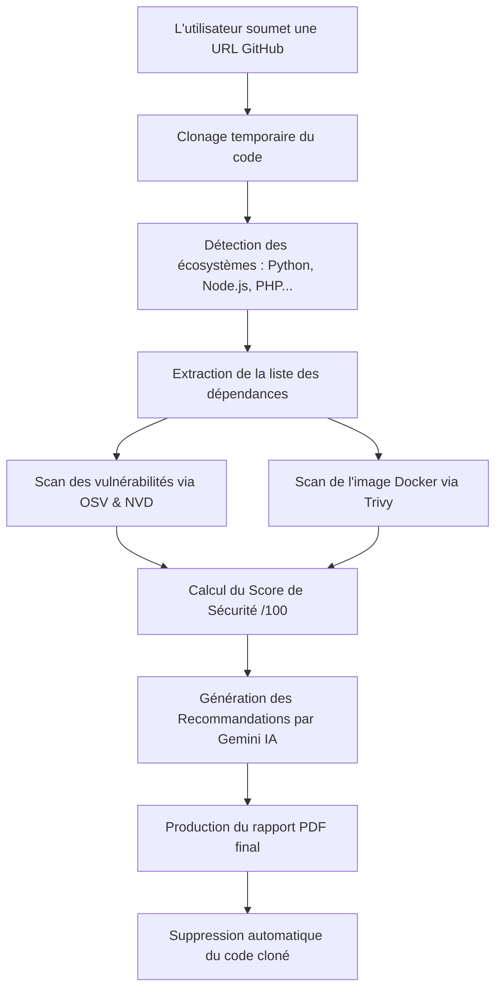

# Rapport de Projet Académique — Plateforme d'Audit de la Chaîne d'Approvisionnement Logicielle
## Présentation d'Avancement pour l'Encadrant de PFE
**Auteur :** Youssef BERRISSOUL

---

## 1. Contexte du Projet : La Sécurité de la Chaîne d'Approvisionnement

Dans le développement logiciel moderne, la majorité des applications ne sont pas écrites à partir de zéro. Les développeurs réutilisent des milliers de briques de code existantes, appelées **bibliothèques** ou **dépendances** (par exemple, des packages pour gérer les connexions réseau, afficher des graphiques, ou sécuriser des formulaires).

### La problématique
Si l'une de ces bibliothèques externes contient une faille de sécurité (vulnérabilité), ou si elle est compromise par un pirate informatique, l'application entière devient vulnérable. C'est ce qu'on appelle un risque sur la **chaîne d'approvisionnement logicielle** (Software Supply Chain).

### L'objectif de notre plateforme
Notre projet résout ce problème en créant un outil automatique capable d'auditer un projet informatique disponible sur GitHub :
1. Il examine l'application pour dresser la liste de tous ses composants externes.
2. Il cherche si certains de ces composants possèdent des failles connues.
3. Il calcule une note globale de sécurité.
4. Il utilise l'Intelligence Artificielle pour suggérer des correctifs simples et clairs sous la forme d'un rapport PDF.

---

## 2. Guide de vulgarisation des technologies choisies

Pour concevoir cette plateforme, nous avons choisi un ensemble de technologies complémentaires. Voici leur description simplifiée et leur rôle précis dans le projet :

### Python 3.12 (Le langage de programmation)
* **Qu'est-ce que c'est ?** Un langage de programmation très populaire, réputé pour sa lisibilité et sa puissance.
* **À quoi sert-il ici ?** Il sert de colonne vertébrale pour écrire toute la logique métier de l'application (le clonage, l'analyse des fichiers, le calcul des scores).

### FastAPI (Le moteur de l'API)
* **Qu'est-ce que c'est ?** Un framework (outil de développement) moderne permettant de créer des APIs web (interfaces de communication pour connecter le serveur au navigateur).
* **À quoi sert-il ici ?** Il gère les requêtes des utilisateurs (par exemple, "lance une analyse sur ce dépôt") et renvoie les réponses rapidement grâce à sa gestion asynchrone (capacité à traiter plusieurs tâches en même temps).

### PostgreSQL (La base de données)
* **Qu'est-ce que c'est ?** Un système de gestion de base de données relationnelle très stable et sécurisé.
* **À quoi sert-il ici ?** Il enregistre de manière permanente toutes les données du projet : l'historique des analyses lancées, les listes des dépendances trouvées, les vulnérabilités détectées et les recommandations générées.

### SQLAlchemy & Alembic (Les gestionnaires de la base de données)
* **Qu'est-ce que c'est ?** 
  * **SQLAlchemy (ORM)** : Un outil qui traduit le code Python en requêtes de base de données SQL. Il permet aux développeurs de manipuler les données comme des objets Python simples.
  * **Alembic** : Un outil de suivi des modifications de la base de données (semblable à un système de versioning comme Git, mais pour les tables PostgreSQL).
* **À quoi servent-ils ici ?** SQLAlchemy évite d'écrire des requêtes complexes manuellement, tandis qu'Alembic permet de mettre à jour la structure de la base de données proprement au fil du développement, sans risquer de perdre les données existantes.

### GitPython & Git (Le clonage automatique)
* **Qu'est-ce que c'est ?** Git est l'outil standard de gestion de code. GitPython est une bibliothèque Python qui permet de contrôler Git par programmation.
* **À quoi sert-il ici ?** Il permet à notre plateforme de télécharger (cloner) automatiquement le code source du projet GitHub ciblé dans un dossier temporaire sur notre serveur pour pouvoir l'analyser.

### OSV API & NVD API (Les répertoires de failles de sécurité)
* **Qu'est-ce que c'est ?**
  * **OSV (Open Source Vulnerabilities)** : Une base de données publique et gratuite regroupant les failles de sécurité des projets open source.
  * **NVD (National Vulnerability Database)** : La base de données officielle du gouvernement américain répertoriant toutes les failles de sécurité mondiales (CVE).
* **À quoi servent-elles ici ?** Notre application interroge ces bases en leur envoyant la liste des dépendances de notre projet pour savoir si l'une d'elles contient une faille connue, sa gravité, et s'il existe une mise à jour corrective.

### Trivy & Docker (La sécurité des conteneurs)
* **Qu'est-ce que c'est ?**
  * **Docker** : Une technologie de "conteneurs" qui permet d'empaqueter une application avec tout son système d'exploitation pour qu'elle fonctionne partout.
  * **Trivy** : Un scanner de sécurité spécialisé dans l'analyse des conteneurs et des fichiers de configuration Docker.
* **À quoi servent-ils ici ?** Trivy analyse l'image Docker du projet pour détecter si le système d'exploitation virtuel de l'application contient des failles de sécurité internes et vérifie que l'image ne s'exécute pas avec les droits administrateurs ("root"), ce qui serait un risque majeur.

### Google Gemini API (L'Intelligence Artificielle)
* **Qu'est-ce que c'est ?** Un modèle d'intelligence artificielle de pointe développé par Google.
* **À quoi sert-elle ici ?** Au lieu de simplement lister des codes de failles incompréhensibles pour un développeur, Gemini analyse les résultats du scan et rédige des recommandations d'action claires, ciblées et personnalisées (par exemple : "Mettez à jour le package X vers la version Y pour corriger la faille Z").

### ReportLab (L'exportation PDF)
* **Qu'est-ce que c'est ?** Une bibliothèque Python spécialisée dans la création dynamique de documents PDF.
* **À quoi sert-elle ici ?** Elle met en forme tous les résultats de l'analyse (score, liste des failles, conseils de l'IA) dans un rapport PDF professionnel téléchargeable en un clic.

---

## 3. Le cycle de vie d'une analyse (Scénario d'usage)

Voici le parcours simplifié d'un scan sur notre plateforme :

---

## 4. Fonctionnement du calcul de score (Vulgarisé)

Le projet évalue la sécurité sur une note de **0 à 100**. Au départ, le projet a la note maximale de **100/100**. Des pénalités sont ensuite déduites selon les failles trouvées :

* **Pénalité par faille critique** (très dangereuse) : **-15 points** (maximum -45 points pour ne pas pénaliser indéfiniment).
* **Pénalité par faille importante** : **-8 points** (maximum -24 points).
* **Pénalité par faille moyenne** : **-3 points** (maximum -15 points).
* **Docker non sécurisé** (exécuté en mode administrateur "root") : **-5 points**.
* **Système d'exploitation Docker obsolète** (failles système Trivy) : jusqu'à **-20 points**.

### Multiplicateurs intelligents
Pour être plus juste, le score prend en compte le contexte :
* Si une faille touche une bibliothèque utilisée uniquement pour les tests (**dépendance de développement**), la pénalité est **divisée par 2** (multiplié par `0.5`).
* Si la faille touche une bibliothèque essentielle au fonctionnement de l'application en production, la pénalité est **augmentée** (multiplié par `1.3`).
* Si un correctif existe mais a été ignoré, la pénalité est augmentée.

---

## 5. État d'avancement et prochaines étapes

### Ce qui est déjà réalisé et fonctionnel :
* **La conception de la base de données** (6 tables prêtes).
* **Le moteur de clonage et de parsing** des fichiers de dépendances.
* **L'intégration des bases de données de failles** (OSV/NVD).
* **L'intégration du scanner de conteneurs Trivy**.
* **L'algorithme de calcul du score de sécurité**.
* **Le moteur d'intelligence artificielle Gemini**.

### Ce qui est en cours de développement (Étape 15 et 16) :
* **La génération automatique du rapport PDF** : Mise en forme visuelle des résultats (courbe de score, tableaux).
* **Le traitement en arrière-plan** : Pour éviter que le navigateur de l'utilisateur ne se bloque pendant le scan (qui prend entre 15 et 30 secondes), le serveur FastAPI enregistrera la demande et effectuera le scan en tâche de fond, permettant à l'utilisateur de suivre la progression en temps réel.

### Ce qu'il reste à faire avant la soutenance :
1. **Le Frontend React** : L'interface graphique utilisateur avec des tableaux de bord, des formulaires de soumission simples et des graphiques interactifs.
2. **Le guide d'utilisation** et la documentation de déploiement final.
